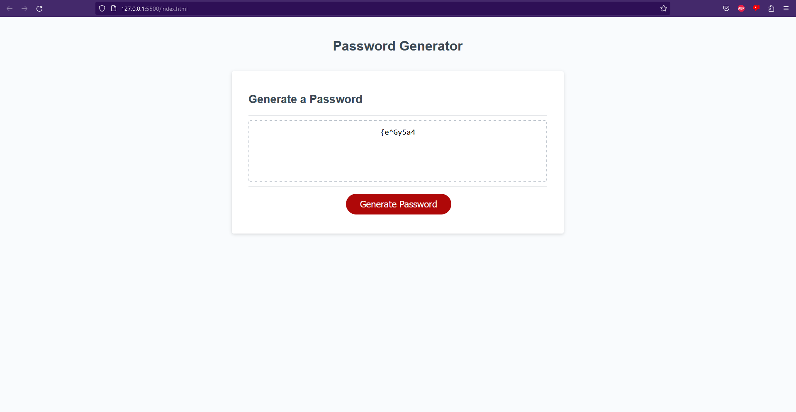

# Password Generator 

This is the Random Password Generator. We are to consider the scenario of an employee with access to sensitive data who wants to keep it secure. First we dimostrate our ability to gather user input through alerts. We confirm whether or not to include lowercase, uppercase, numeric, and/or special characters. We make sure that the requirments meet the length and have the critiria. Should the password not have any criteria, be too short, or long, an error will appear instead of a password. When the password is created it will be displayed in the field. 

https://github.com/J05H94/03-Challenge
https://j05h94.github.io/03-Challenge/

